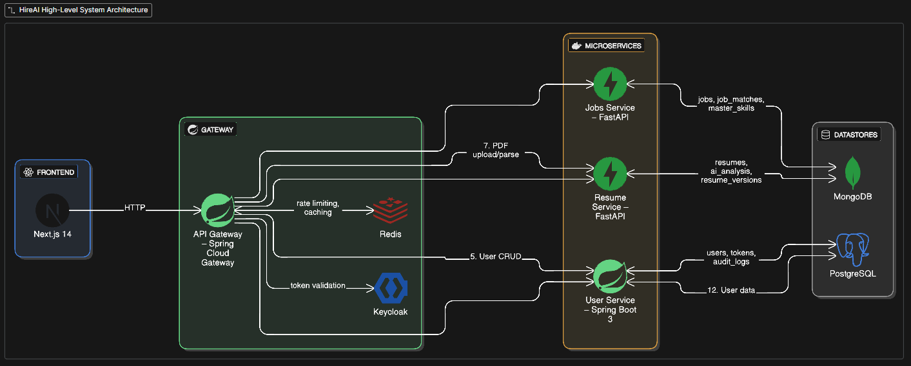

# HireAI – AI-Powered Career Platform

An end-to-end, microservices-based platform to help people build better resumes, sign in securely, and match jobs with AI.

Badges: Spring Boot 3 • Next.js 14 • FastAPI • Docker Compose • PostgreSQL • Redis • Keycloak

---

## What this repo includes today

- API Gateway (Spring Cloud Gateway)
- User Service (Spring Boot): user CRUD, JWT, Keycloak integration, audit logs, cleanup/consistency jobs
- Frontend (Next.js 14): auth pages and a simple dashboard
- Infrastructure via Docker Compose: PostgreSQL, Redis, Keycloak, PgAdmin
- Rate limiting at the gateway, CORS set for localhost, health checks
- Job Matcher microservice (alpha): FastAPI wrapper for job extraction/matching
- Resume Service (FastAPI): PDF upload/parse, AI enhancement, ATS scoring
- Jobs Service (FastAPI): job feed, matching, insights

---

## Architecture

Diagram placeholder:



---

## Prerequisites

- Docker Desktop 4.20+
- Node.js 18+ and npm 9+
- Java 17 and Maven 3.9+
- Git 2.40+

Quick checks:
- `docker --version`, `docker compose version`
- `node -v`, `npm -v`
- `java -version`, `mvn -version`

---

## Quick start

1) Clone
- `git clone https://github.com/<org>/HireAI.git`
- `cd HireAI`

2) Start backend stack
- `docker compose up -d`
- Expected containers: gateway, user-service, postgres, redis, keycloak, pgadmin

3) Configure Keycloak (first run)
- Admin console: http://localhost:8080/admin (admin / admin)
- Realm: `resume-platform`
- Client: `user-service` (copy secret)
- Enable user registration if needed.

4) Frontend env (`frontend/.env.local`):
```
NEXTAUTH_URL=http://localhost:3000
NEXTAUTH_SECRET=<base64-32>
KEYCLOAK_CLIENT_ID=user-service
KEYCLOAK_CLIENT_SECRET=<keycloak-secret>
KEYCLOAK_ISSUER=http://localhost:8080/realms/resume-platform
NEXT_PUBLIC_KEYCLOAK_ISSUER=http://localhost:8080/realms/resume-platform
NEXT_PUBLIC_KEYCLOAK_CLIENT_ID=user-service
NEXT_PUBLIC_API_URL=http://localhost:8090
NEXT_PUBLIC_JOB_MATCHER_URL=http://localhost:8010
```

5) Frontend
- `npm install`
- `npm run dev` → http://localhost:3000

Health checks:
- Gateway: `curl http://localhost:8090/actuator/health`
- User Service: `curl http://localhost:8081/actuator/health`

---

## Local development

User Service:
- `cd Services/user`
- `mvn spring-boot:run`

Gateway:
- `cd Services/gateway`
- `mvn spring-boot:run`

Frontend:
- `cd frontend`
- `npm run dev`
- Type check: `npm run type-check`

### Job Matcher (alpha)

Path: `Services/JobsService/job_matcher`
API: `src/job_matcher/api_server.py`
Endpoints: `POST /api/v1/jobs/extract`, `GET /api/v1/health`
Compose service: `job-matcher` (8010)
Frontend page: `frontend/pages/job-matcher.tsx`

Run locally:
```
docker compose up -d redis mongodb
cd Services/JobsService/job_matcher
$env:GEMINI_API_KEY='your_gemini_key'
$env:FIRECRAWL_API_KEY='your_firecrawl_key'
pip install -r requirements.txt
python -m uvicorn job_matcher.api_server:app --host 0.0.0.0 --port 8000
```
Use `NEXT_PUBLIC_JOB_MATCHER_URL=http://localhost:8000` for local run.

Minimal request:
```
POST /api/v1/jobs/extract
{
  "job_url": "https://example.com/job",
  "cv_data": { "text": "Resume text", "fileName": "resume.pdf" },
  "candidate_id": "user@example.com"
}
```

Troubleshooting:
- 500 → check GEMINI/FIRECRAWL keys and logs
- CORS → verify `NEXT_PUBLIC_JOB_MATCHER_URL`

---

## Environment

Gateway:
- `SPRING_PROFILES_ACTIVE=dev`
- `USER_SERVICE_URL=http://user-service:8081`
- `REDIS_HOST=redis` / `REDIS_PORT=6379`
- `KEYCLOAK_ISSUER_URI=http://keycloak:8080/realms/resume-platform`

User Service:
- `SPRING_PROFILES_ACTIVE=dev`
- `KEYCLOAK_SERVER_URL=http://keycloak:8080`
- `KEYCLOAK_REALM=resume-platform`
- `KEYCLOAK_ADMIN_USERNAME=admin`
- `KEYCLOAK_ADMIN_PASSWORD=admin`
- `DATABASE_URL=jdbc:postgresql://postgresql:5432/resume_db`
- `DATABASE_USERNAME=resume_user`
- `DATABASE_PASSWORD=resume_password`

---

## How things work

- Auth via Keycloak (JWT) through Gateway.
- Rate limiting with Redis token bucket.
- User data in PostgreSQL; resume/jobs planned for MongoDB.
- Health endpoints and container logs for ops.

---

## Troubleshooting

- Port busy (Windows): `Get-Process -Id (Get-NetTCPConnection -LocalPort 8080).OwningProcess | Stop-Process -Force`
- Recreate stack: `docker compose down -v && docker compose up -d --build`
- Redis ping: `docker exec -it ms-redis redis-cli ping`

---

## Roadmap (short)

- Resume: enhanced parsing, AI scoring
- Jobs: feed aggregation, matching insights
- Observability: metrics, centralized logging
- Production: TLS, CI/CD, backups, HA Redis/DB
- Job Matcher: PDF parsing, persistence, gateway routing, caching, rate limits

---

## License

MIT. See `LICENSE`.

